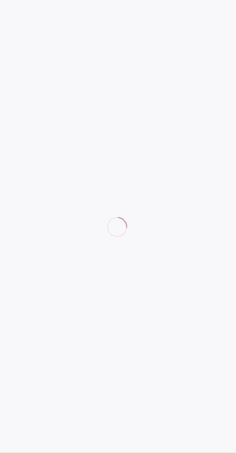
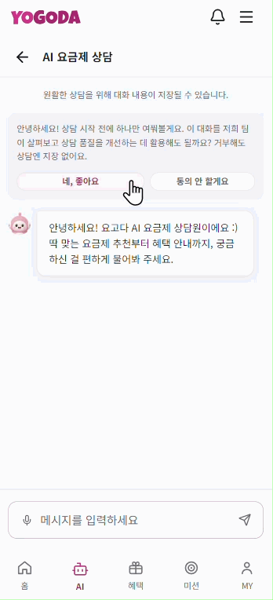
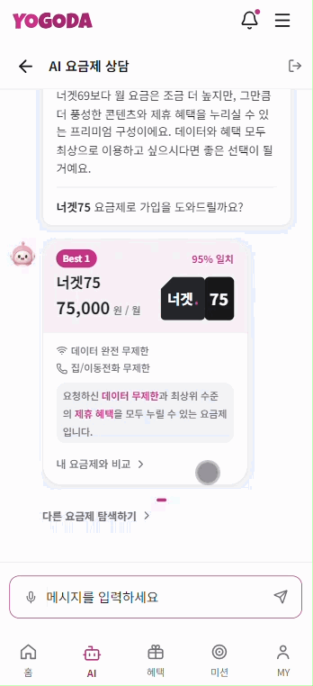
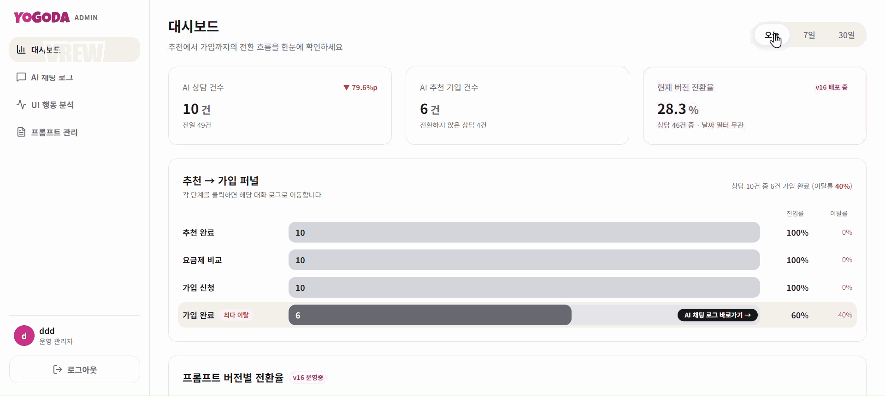
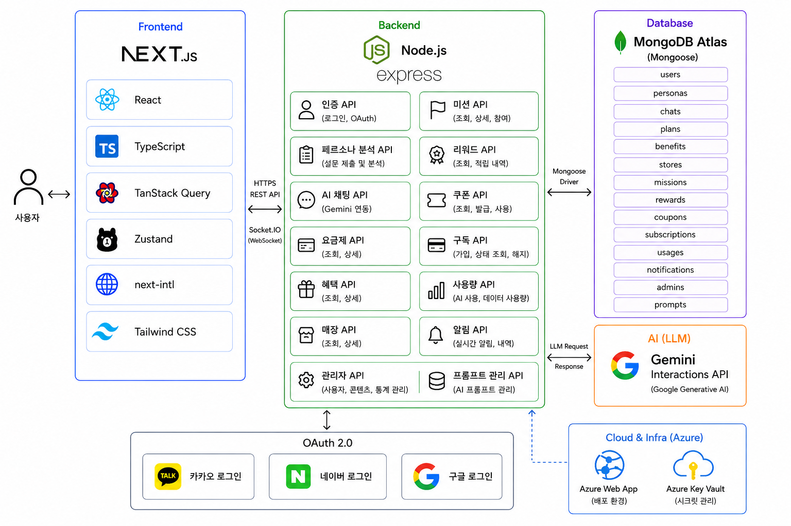

# Yogoda

대화 몇 마디로 끝나는 요금제 상담. AI가 의도를 파악하고, 탐색 없이 LG U+ 맞춤 요금제를 제시하여 가입까지 이어지는 서비스

---

## Introduction

[문제] 통신 요금제는 고려 요소가 많아 사용자가 직접 비교하고 선택하기 어렵고, 기존 통신사 앱은 요금제 추천까지만 제공할 뿐 실제 가입 여부와 이탈 지점을 알 수 없음

[해결] 사용자의 이용 패턴과 성향을 분석하여 맞춤 요금제를 추천하고, 확신을 주는 단계(추천 이유, 적합도, 비교, 절약 금액)를 설계하여 가입 전환까지 연결. 관리자가 전환 과정을 모니터링하고 직접 개선할 수 있는 구조를 제공

[목표] 추천 → 확신 → 가입 → 모니터링 → 개선의 순환 구조 구현

---

## Development Period

2026.08.14 ~ 2026.09.03

---

## Team

<table>
  <tr>
    <td align="center" width="180px">
      <a href="https://github.com/jun6390">
        
        <br />
        <sub><b>박해준</b></sub>
      </a>
      <br />
      <b>FE / BE</b>
    </td>
    <td align="center" width="180px">
      <a href="https://github.com/daenggg">
        
        <br />
        <sub><b>고유정</b></sub>
      </a>
      <br />
      <b>FE / BE</b>
    </td>
    <td align="center" width="180px">
      <a href="https://github.com/jhwest-dev">
        
        <br />
        <sub><b>서지현</b></sub>
      </a>
      <br />
      <b>FE / BE</b>
    </td>
  </tr>
</table>

---

## Tech Stack

<table>
  <tr>
    <th width="120px">Frontend</th>
    <td>
      
      
      
      
      
      
      
      
      
    </td>
  </tr>
  <tr>
    <th width="120px">Backend</th>
    <td>
      
      
      
      
      
      
      
    </td>
  </tr>
  <tr>
    <th width="120px">AI</th>
    <td>
      
      
    </td>
  </tr>
  <tr>
    <th width="120px">Database</th>
    <td>
      
      
    </td>
  </tr>
  <tr>
    <th width="120px">Cloud</th>
    <td>
      
    </td>
  </tr>
  <tr>
    <th width="120px">Quality</th>
    <td>
      
      
      
      
      
    </td>
  </tr>
  <tr>
    <th width="120px">Collaboration</th>
    <td>
      
      
      
      
      
      
    </td>
  </tr>
</table>

---

## Main Features

### 온보딩 및 사용자 성향 분석

- 서비스 최초 진입 시 온보딩 및 개인정보 보호 안내 제공
- 통신 이용 성향에 대한 설문 진행
- 설문 결과 기반 사용자 유형 분석 및 추천에 활용

<div align="center">
  
</div>

### AI 맞춤 요금제 추천

- 사용자의 이용 패턴 및 성향 기반 요금제 추천
- 적합도가 높은 순서대로 최대 3개 요금제 제안
- 추천 이유 및 적합도 표시

### AI 챗봇 상담

- 자연어 기반 요금제 관련 질의응답
- 설문 결과, 이전 대화, 현재 요금제를 기반으로 요금제 안내 및 추천
- 실시간 스트리밍 응답, 대화 중단 및 비회원 상담 이어가기

<div align="center">
  
</div>

### 요금제 탐색 및 비교

- 요금제 목록, 상세 정보, 혜택 제공
- 조건별 검색 및 필터링
- 2~3개 요금제 비교 (AI 추천 요금제 강조)

### 요금제 가입

- 사기 예방 안내 → 약관 동의 → 본인 확인 → 혜택 선택 → 결제 수단 선택 → 완료까지의 가입 흐름 시뮬레이션

<div align="center">
  
</div>

### 혜택 및 MY

- 혜택 일정, 내 주변 지도, 찜 및 직영 매장 탐색
- 출석, 미션, 포인트 상품 및 쿠폰 사용
- 구독 서비스 관리와 월별 사용 패턴 기반 AI 요금제 재추천
- 새 추천, 출석, 쿠폰 및 미완료 상담 실시간 알림

<div align="center">
  
</div>

---

## Admin Features

### 상담 퍼널 분석 및 전환율 추적

- AI 채팅 흐름의 단계별 이탈 지점 시각화 (일/주/월)
- 상담 시작 → 추천 확인 → 가입 완료까지의 전환율 측정

### UI 클릭 히트맵

- AI 채팅 내 버튼·영역별 클릭률 분석
- 사용자가 반응하지 않는 UI 요소 파악

### 프롬프트 버전 관리 및 A/B 테스트

- AI 상담 프롬프트 수정·저장·배포
- 프롬프트 버전별 트래픽 분배 및 전환율 비교
- 데이터 기반으로 우수 버전 채택

### 상담 세션 및 UI 분석

- 상담 세션과 메시지 로그 조회
- 요금제 상세, 비교, 가입 버튼 등 주요 UI의 조회·클릭 데이터 분석

<div align="center">
  
</div>

---

## Architecture

<div align="center">
  
</div>

- Next.js 클라이언트는 HTTPS REST API를 통해 인증, 사용자, 요금제 및 혜택 데이터를 조회합니다.
- 실시간 AI 상담과 사용자 알림은 Socket.io를 통해 메시지를 송수신합니다.
- Express 서버는 Gemini Interactions API와 통신하여 상담 응답, 페르소나 분석 및 요금제 추천을 생성합니다.
- 사용자, 요금제, 혜택 및 상담 내역은 MongoDB Atlas에 저장하고 Mongoose로 관리합니다.
- 소셜 로그인은 OAuth 2.0 기반으로 카카오, 네이버, 구글 인증을 지원합니다.

---

## Getting Started

### Requirements

- Node.js 22 이상
- npm
- 실행 중인 [Yogoda Backend](https://github.com/ureca-yogoda/yogoda-backend)
- OAuth 앱 Client ID와 Naver Maps Client ID

### Installation

```bash
npm install
copy .env.example .env.local
npm run dev
```

macOS 또는 Linux에서는 `cp .env.example .env.local`을 사용합니다. 개발 서버는 기본적으로 [http://localhost:3000](http://localhost:3000)에서 실행됩니다.

### Environment Variables

| 변수                           | 설명                                |
| ------------------------------ | ----------------------------------- |
| `NEXT_PUBLIC_API_BASE_URL`     | Backend API 및 Socket.IO 주소       |
| `NEXT_PUBLIC_KAKAO_CLIENT_ID`  | 카카오 OAuth Client ID              |
| `NEXT_PUBLIC_NAVER_CLIENT_ID`  | 네이버 OAuth Client ID              |
| `NEXT_PUBLIC_GOOGLE_CLIENT_ID` | Google OAuth Client ID              |
| `NEXT_PUBLIC_NAVER_MAP_KEY_ID` | Naver Maps JavaScript API Client ID |

OAuth 콜백 URI는 `http://localhost:3000/auth/{provider}/callback` 형식으로 등록합니다. `provider`는 `kakao`, `naver`, `google` 중 하나입니다.

### Scripts

| 명령                      | 설명                           |
| ------------------------- | ------------------------------ |
| `npm run dev`             | 개발 서버 실행                 |
| `npm run build`           | 프로덕션 빌드                  |
| `npm run start`           | 프로덕션 서버 실행             |
| `npm run lint`            | ESLint와 UI 일관성 감사 실행   |
| `npm run format:check`    | Prettier 포맷 검사             |
| `npm run storybook`       | Storybook을 6006 포트에서 실행 |
| `npm run build-storybook` | 정적 Storybook 빌드            |

---

## Project Structure

```text
src/
├─ app/          # App Router 페이지, 로케일 및 레이아웃
├─ components/   # 도메인 컴포넌트와 공통 UI
├─ data/         # 화면 구성용 정적 데이터
├─ hooks/        # API, 소켓 및 화면 상태 훅
├─ i18n/         # next-intl 라우팅 설정
├─ lib/          # API 클라이언트와 외부 서비스 연동
├─ providers/    # 전역 Context Provider
├─ stores/       # Zustand 상태 저장소
├─ styles/       # 디자인 토큰과 전역 스타일
└─ types/        # 공통 TypeScript 타입
```
